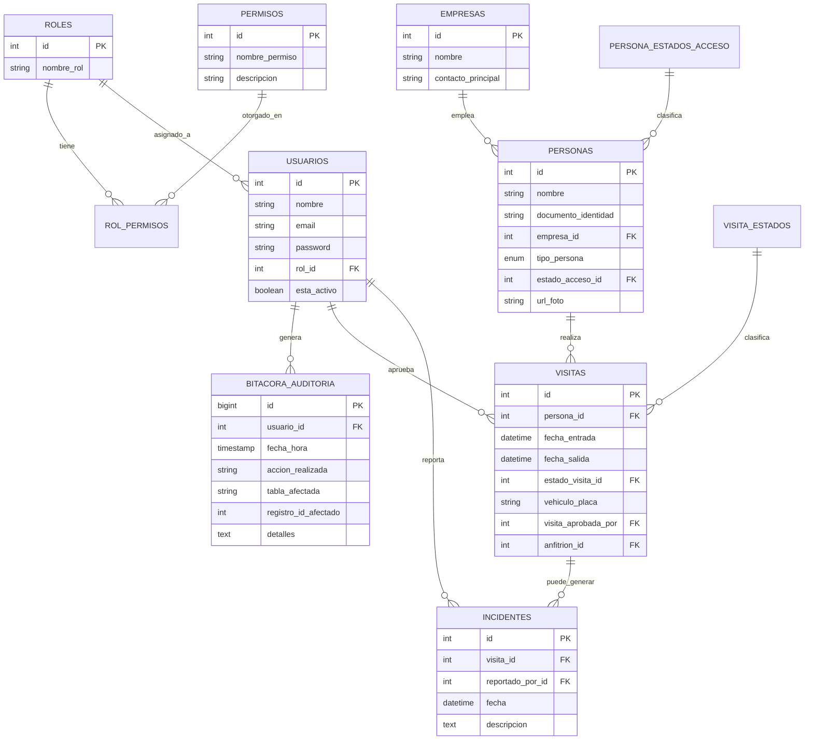

# SICA — Sistema Integrado de Control de Acceso


Proyecto académico para el Complejo Empresarial **Zona Acme**. Reemplaza el
registro manual en papel por un sistema en Java + MySQL con control
de acceso basado en roles (RBAC), auditoría inmutable y cuatro flujos de
ingreso distintos. Incluye dos interfaces: una gráfica en **JavaFX**
(dashboard verde/blanco) y una de **consola**, ambas sobre la misma capa de
negocio.

## 1. Descripción del proyecto

Zona Acme alberga más de 30 empresas y controlaba su acceso con libros de
registro en papel: sin trazabilidad, sin control de permisos, y con cuellos
de botella para invitados no anunciados. SICA digitaliza ese proceso:

- **RBAC real**: los permisos no están escritos en el código, viven en la
  base de datos (`roles`, `permisos`, `rol_permisos`), así que se pueden
  reconfigurar sin recompilar la aplicación.
- **Auditoría inmutable**: toda acción crítica (logins, CRUD de entidades,
  cambios de estado, incidentes, check-in/check-out) se registra en
  `bitacora_auditoria` desde la capa de servicio.
- **Cuatro flujos de ingreso** que reflejan la realidad de una portería:
  invitado pre-registrado, invitado no anunciado (aprobación en tiempo real),
  trabajador con carnet olvidado, y regularización automática de salidas
  olvidadas.

## 2. Modelo de la base de datos



Scripts en `db/schema.sql` (estructura) y `db/data.sql` (datos semilla:
roles, permisos, asignaciones RBAC, usuarios de ejemplo, estados, empresas).

## 3. Decisiones de diseño

### Arquitectura general (MVC + capas)

```
controller/  -> Controladores de consola (capa Controller)
view/        -> Entrada/salida de consola (parte de View)
service/     -> Lógica de negocio (Model, en el sentido de "dominio")
repository/  -> Acceso a datos (interfaces = puertos, impl/ = adaptadores JDBC)
model/       -> Entidades del dominio
factory/     -> Creación centralizada de repositorios
decorator/   -> Auditoría transversal
observer/    -> Notificaciones en tiempo real
exception/   -> Excepciones de negocio propias
ui/          -> Interfaz gráfica JavaFX (login, dashboard, diálogos)
```

### Estructura de carpetas

```
ProyectoSICA/
├── db/
│   ├── schema.sql              # Creación de las 11 tablas
│   └── data.sql                # Roles, permisos, usuarios y datos de ejemplo
├── docker-compose.yml          # MySQL 8 listo para desarrollo local
├── pom.xml
├── README.md
└── src/main/
    ├── java/com/acme/sica/
    │   ├── App.java             # Entrada de la versión consola
    │   ├── config/               # Conexión BD (Singleton) + hash de passwords
    │   ├── model/                 # Entidades: Usuario, Persona, Visita, etc.
    │   ├── exception/             # Excepciones de negocio propias
    │   ├── repository/            # Interfaces (puertos)
    │   │   └── impl/               # Implementaciones JDBC (adaptadores)
    │   ├── factory/               # RepositoryFactory (Factory Method)
    │   ├── observer/              # Notificaciones en tiempo real (Observer)
    │   ├── decorator/             # Auditoría automática (Decorator)
    │   ├── service/               # Reglas de negocio y RBAC
    │   │   └── flujos/             # Los 4 escenarios de ingreso (Strategy)
    │   ├── controller/            # Controladores de consola
    │   ├── view/                  # Entrada/salida de consola
    │   └── ui/                    # Interfaz gráfica JavaFX
    │       ├── MainApp.java        # Punto de entrada gráfico
    │       ├── Launcher.java       # Lanzador (evita error de módulos JavaFX)
    │       └── dialogs/            # Un diálogo por cada operación
    └── resources/css/theme.css   # Tema visual verde suave + blanco
```

### Principios SOLID aplicados

| Principio | Dónde y por qué |
|---|---|
| **SRP** | Cada clase tiene una única razón de cambio: `ConexionBD` solo gestiona la conexión, `AutorizacionService` solo valida permisos, `AuditoriaRepositoryJDBC` solo escribe/lee la bitácora. |
| **OCP** | El patrón Strategy (`FlujoAcceso`) permite agregar un quinto escenario de ingreso sin modificar `AccesoService` ni las estrategias existentes. |
| **LSP** | `AccesoServiceAuditoriaDecorator` implementa `AccesoServiceI` y puede sustituir a `AccesoService` en cualquier parte del código sin romper nada. |
| **ISP** | Los repositorios son interfaces pequeñas y específicas (`UsuarioRepository`, `PersonaRepository`, etc.) en vez de un único `Repository` genérico con decenas de métodos. |
| **DIP** | Los servicios dependen de las interfaces de `repository/`, nunca de las clases `*JDBC` directamente; `RepositoryFactory` es el único punto que conoce las implementaciones concretas. |

### Patrones de diseño (5, cumpliendo el mínimo de la rúbrica)

1. **Singleton** — `ConexionBD`: una sola conexión JDBC gestionada centralmente.
2. **Factory Method** — `RepositoryFactory`: centraliza la creación de repositorios; si se cambia la tecnología de persistencia, solo se toca esta clase.
3. **Strategy** — `FlujoAcceso` (`FlujoInvitadoPreregistrado`, `FlujoInvitadoNoAnunciado`, `FlujoCarnetOlvidado`): cada escenario de ingreso es una estrategia intercambiable seleccionada por `AccesoService`.
4. **Observer** — `GestorNotificaciones` + `ObservadorNotificacion` + `FuncionarioConsolaObserver`: al crear una visita pendiente, se notifica en tiempo real a los observadores suscritos (simulando la notificación al Funcionario de Empresa).
5. **Decorator** — `AccesoServiceAuditoriaDecorator`: envuelve `AccesoService` para alimentar `bitacora_auditoria` después de cada operación exitosa, sin mezclar esa responsabilidad con las reglas de negocio.

### Lambdas y Stream API

Concentrados sobre todo en `ReporteService` (conteos con `groupingBy` +
`counting`, filtrado de personas dentro del complejo con `filter`/`map`/
`distinct`/`sorted`) y en `GestorNotificaciones` (`forEach` con lambda para
notificar observadores), en vez de bucles `for` tradicionales.

## 4. Interfaz gráfica (JavaFX)

Además de la versión de consola (`App.java`, se conserva como referencia),
el proyecto incluye un **dashboard visual en JavaFX** (`ui/MainApp.java`) con
tema verde suave + blanco:

- **Login** — tarjeta blanca centrada, con validación y mensaje de error en línea.
- **Dashboard** — barra superior con la sesión activa y una grilla de
  tarjetas tipo panel de mando; cada tarjeta solo aparece si el rol del
  usuario tiene el permiso RBAC correspondiente (las mismas reglas de negocio
  de siempre, solo que ahora también deciden qué botones se dibujan).
- **Notificaciones en tiempo real** — al crearse una visita pendiente de
  aprobación, aparece un toast verde flotante (mismo patrón Observer que en
  consola, con un observador distinto: `NotificacionToast`).
- Todos los formularios (registrar ingreso, aprobar visitas, crear
  usuarios, reportes, bitácora, etc.) están en `ui/dialogs/`, reutilizando
  exactamente los mismos servicios de la capa `service/` — la lógica de
  negocio, el RBAC y los 5 patrones de diseño no cambiaron, solo la capa de
  presentación.

## 5. Base de datos con Docker

El proyecto incluye `docker-compose.yml` con MySQL 8 ya configurado para
coincidir con las credenciales por defecto de `ConexionBD.java`
(`root`/`root`, puerto `3306`, base `sica_db`), y con `schema.sql` +
`data.sql` montados para cargarse automáticamente la primera vez.

```bash
# Levantar el contenedor (crea la BD, tablas y datos semilla automáticamente)
docker compose up -d

# Verificar que quedó arriba y saludable
docker compose ps

# Ver logs si algo falla
docker compose logs -f sica_mysql
```

Con eso, `ConexionBD.java` ya apunta al lugar correcto sin tocar nada más.

## 6. Instalación y ejecución

### Requisitos
- JDK 17+
- Maven 3.8+
- MySQL 8+ corriendo localmente

### Pasos

```bash
# 1. Crear la base de datos y cargar los datos semilla
mysql -u root -p < db/schema.sql
mysql -u root -p < db/data.sql

# 2. Configurar credenciales de conexión (si tu MySQL local no es root/root)
#    definí las variables de entorno DB_URL / DB_USER / DB_PASSWORD antes de
#    ejecutar, por ejemplo (Windows PowerShell):
#      $env:DB_PASSWORD = "tu_password_local"
#    o en Linux/Mac:
#      export DB_PASSWORD=tu_password_local
#    Si no se definen, se usan los valores por defecto (root/root, sica_db).

# 3a. Ejecutar la versión GRÁFICA (JavaFX) — recomendada, más confiable
mvn clean javafx:run

# 3b. O compilar el jar ejecutable con todo incluido
mvn clean package
java -jar target/sica-jar-with-dependencies.jar

# 3c. Si ejecutas desde el botón "Run" de un IDE (VS Code, IntelliJ, etc.)
#     NO selecciones MainApp.java como clase a ejecutar — selecciona
#     Launcher.java (com.acme.sica.ui.Launcher). Es un lanzador que evita el
#     error "JavaFX runtime components are missing" al ejecutar directamente
#     una clase que extiende Application.

# 3d. Si prefieres la versión de consola original:
#     ejecuta la clase com.acme.sica.App (no requiere JavaFX)
```

## 7. Guía de uso — credenciales de ejemplo por rol

Todas las contraseñas de ejemplo son: **`Acme#2026`**

| Rol | Email | Qué puede hacer |
|---|---|---|
| Superusuario | `admin@acme.com` | Todo el sistema, incluida gestión de usuarios y empresas |
| Supervisor de Seguridad | `supervisor@acme.com` | Operación completa de accesos, incidentes y auditoría |
| Guarda de Seguridad | `guarda@acme.com` | Registrar ingresos/salidas, crear personas, reportar incidentes |
| Funcionario de Empresa | `funcionario@acme.com` | Aprobar/rechazar visitas pendientes, registrar invitados propios |

### Flujo de prueba sugerido

1. Inicia sesión como **Guarda** (`guarda@acme.com`) → "Registrar ingreso" con
   el documento `1122334455` (invitado de ejemplo, sin visita pre-aprobada) →
   el sistema lo deja "Pendiente de Aprobación" y notifica en tiempo real
   (toast verde en la versión gráfica, mensaje en la versión de consola).
2. Inicia sesión como **Funcionario** (`funcionario@acme.com`) → "Aprobaciones
   pendientes" → aprueba la visita.
3. Vuelve a iniciar sesión como **Guarda** → revisa "Personas dentro del
   complejo" para confirmar el check-in.
4. Revisa "Bitácora de auditoría" (rol Superusuario o Supervisor) para ver
   cómo cada acción anterior quedó registrada automáticamente.

## 8. Para el examen — cómo crear una nueva funcionalidad, paso a paso

Guía genérica para cuando en el examen te pidan agregar "lo que sea" al
proyecto. Sirve tanto si es un CRUD nuevo, un reporte, un botón extra en el
dashboard, o una regla de negocio. La idea: **siempre atraviesas las mismas
capas, en el mismo orden**, porque la arquitectura es MVC + capas (ver
sección 3). Nunca saltes una capa (por ejemplo, nunca llames JDBC desde un
diálogo de `ui/`).

### 8.1 Ubica en qué capa vive lo que te piden

| Si te piden... | Empieza en... |
|---|---|
| Un dato nuevo (columna, tabla) | `db/schema.sql` (y `data.sql` si necesita semilla) |
| Una regla de negocio / validación | `service/` (o `util/Validaciones.java` si es una validación de formato) |
| Una consulta nueva a la BD | `repository/` (interfaz) + `repository/impl/` (JDBC) |
| Un botón o pantalla nueva | `ui/dialogs/` + registrar el botón en `ui/DashboardView.java` |
| Un permiso nuevo (quién puede usar la funcionalidad) | tabla `permisos` / `rol_permisos` en la BD |

### 8.2 Flujo paso a paso (de abajo hacia arriba)

**Paso 1 — Base de datos (si aplica).** Si tu funcionalidad necesita guardar
algo nuevo, agrega la columna/tabla en `db/schema.sql`. Ejemplo: agregar un
campo `telefono` a `personas`:
```sql
ALTER TABLE personas ADD COLUMN telefono VARCHAR(20) NULL;
```

**Paso 2 — Modelo (`model/`).** Agrega el campo/entidad con su getter y
setter. Ejemplo en `Persona.java`:
```java
private String telefono;
public String getTelefono() { return telefono; }
public void setTelefono(String telefono) { this.telefono = telefono; }
```

**Paso 3 — Repositorio: interfaz + implementación JDBC.** Primero declaras
el método en la interfaz (el "puerto"), luego lo implementas en `impl/` (el
"adaptador"). Ejemplo: agregar un método para contar visitas por empresa en
`repository/VisitaRepository.java`:
```java
/** Cuenta cuántas visitas registradas tiene una empresa (para un reporte). */
int contarVisitasPorEmpresa(int empresaId);
```
Y en `repository/impl/VisitaRepositoryJDBC.java`:
```java
@Override
public int contarVisitasPorEmpresa(int empresaId) {
    String sql = "SELECT COUNT(*) FROM visitas v JOIN personas p ON v.persona_id = p.id " +
            "WHERE p.empresa_id = ?";
    try (PreparedStatement ps = ConexionBD.getInstancia().getConexion().prepareStatement(sql)) {
        ps.setInt(1, empresaId);
        try (ResultSet rs = ps.executeQuery()) {
            return rs.next() ? rs.getInt(1) : 0;
        }
    } catch (SQLException e) {
        throw new RuntimeException("Error al contar visitas por empresa", e);
    }
}
```
*Tip:* si agregas un método a la interfaz, revisa si hay más de una clase
`implements` esa interfaz — todas deben implementarlo o no compila.

**Paso 4 — Servicio (`service/`): la regla de negocio y el RBAC.** Aquí va
la lógica real: validaciones, permisos, y quién puede hacer qué. Ejemplo en
`service/ReporteService.java`:
```java
public int reporteVisitasPorEmpresa(Usuario operador, int empresaId) {
    AutorizacionService.verificarPermiso(operador, "ver_reportes"); // RBAC
    return visitaRepository.contarVisitasPorEmpresa(empresaId);
}
```
Si tu funcionalidad debe quedar en la bitácora de auditoría, revisa
`decorator/AccesoServiceAuditoriaDecorator.java` como ejemplo de cómo se
envuelve un servicio para loguear la acción automáticamente.

**Paso 5 — Interfaz gráfica (`ui/dialogs/`).** Crea (o reutiliza) un diálogo
que llame al servicio del paso 4 — nunca al repositorio directamente.
Ejemplo mínimo de diálogo, siguiendo el patrón de los que ya existen:
```java
public static void verVisitasPorEmpresa(MainApp app) {
    List<Empresa> empresas = app.getEmpresaRepository().listarTodas();
    ComboBox<Empresa> combo = new ComboBox<>();
    combo.getItems().addAll(empresas);
    combo.setPromptText("Selecciona una empresa");

    Dialog<Void> dialog = DialogoBase.crear("Visitas por empresa");
    VBox contenido = new VBox(16, UiUtil.campoConEtiqueta("Empresa", combo));
    contenido.setPadding(new Insets(24));
    dialog.getDialogPane().setContent(contenido);

    DialogoBase.agregarBotones(dialog, "Consultar", () -> {
        Empresa e = combo.getValue();
        if (e == null) throw new IllegalArgumentException("Selecciona una empresa.");
        int total = app.getReporteService().reporteVisitasPorEmpresa(app.getSesionActual(), e.getId());
        UiUtil.mostrarExito("Resultado", "Total de visitas: " + total);
    });
    dialog.showAndWait();
}
```

**Paso 6 — Registrar el botón en el dashboard.** En
`ui/DashboardView.java`, agrega la tarjeta/botón, condicionada al permiso
RBAC correspondiente (así respetas el patrón que ya usa todo el proyecto):
```java
if (app.getSesionActual().tienePermiso("ver_reportes")) {
    tarjetas.add(UiUtil.crearTarjeta("Visitas por empresa", "📊",
            () -> IngresoDialogs.verVisitasPorEmpresa(app))); // o el dialog que corresponda
}
```

**Paso 7 — Permisos (si es funcionalidad nueva de rol).** Si el permiso no
existe todavía, agrégalo en `db/data.sql`:
```sql
INSERT INTO permisos (nombre_permiso, descripcion) VALUES ('ver_reportes', 'Puede ver reportes');
INSERT INTO rol_permisos (rol_id, permiso_id) SELECT r.id, p.id FROM roles r, permisos p
    WHERE r.nombre_rol = 'Supervisor de Seguridad' AND p.nombre_permiso = 'ver_reportes';
```

**Paso 8 — Compilar y probar.**
```bash
mvn clean compile
mvn clean javafx:run
```

### 8.3 Checklist mental para el examen

1. ¿Qué dato necesito? → ¿toca la BD? (`schema.sql`/`data.sql`)
2. ¿Qué entidad lo representa? → `model/`
3. ¿Cómo lo leo/guardo? → `repository/` (interfaz) → `repository/impl/` (JDBC)
4. ¿Qué regla de negocio o permiso aplica? → `service/`
5. ¿Cómo lo ve el usuario? → `ui/dialogs/` + botón en `ui/DashboardView.java`
6. ¿Compila y corre? → `mvn clean javafx:run`

Si el examen pide explícitamente un patrón de diseño para la nueva
funcionalidad, revisa cuál de los 5 ya usados encaja (Strategy si es "un
escenario más" como los flujos de ingreso, Observer si es "algo debe
notificarse en tiempo real", Decorator si es "una capa extra sobre un
servicio existente sin tocarlo").

### 8.4 Más ejemplos de funcionalidades completas

#### Ejemplo A — CRUD nuevo: "Registrar visitante VIP" (nueva tabla)

**1. `db/schema.sql`:**
```sql
CREATE TABLE visitantes_vip (
    id INT AUTO_INCREMENT PRIMARY KEY,
    persona_id INT NOT NULL,
    motivo VARCHAR(200),
    registrado_en TIMESTAMP DEFAULT CURRENT_TIMESTAMP,
    FOREIGN KEY (persona_id) REFERENCES personas(id)
);
```

**2. `model/VisitanteVip.java`:**
```java
public class VisitanteVip {
    private int id;
    private Persona persona;
    private String motivo;
    private LocalDateTime registradoEn;
    // getters y setters
}
```

**3. `repository/VisitanteVipRepository.java` + `impl/VisitanteVipRepositoryJDBC.java`:**
```java
public interface VisitanteVipRepository {
    VisitanteVip guardar(VisitanteVip vip);
    List<VisitanteVip> listarTodos();
}
```
```java
@Override
public VisitanteVip guardar(VisitanteVip vip) {
    String sql = "INSERT INTO visitantes_vip (persona_id, motivo) VALUES (?,?)";
    try (PreparedStatement ps = ConexionBD.getInstancia().getConexion()
            .prepareStatement(sql, Statement.RETURN_GENERATED_KEYS)) {
        ps.setInt(1, vip.getPersona().getId());
        ps.setString(2, vip.getMotivo());
        ps.executeUpdate();
        try (ResultSet keys = ps.getGeneratedKeys()) {
            if (keys.next()) vip.setId(keys.getInt(1));
        }
    } catch (SQLException e) {
        throw new RuntimeException("Error al guardar visitante VIP", e);
    }
    return vip;
}
```

**4. `service/VisitanteVipService.java` (RBAC + regla de negocio):**
```java
public VisitanteVip registrarVip(Usuario operador, int personaId, String motivo) {
    AutorizacionService.verificarPermiso(operador, "registrar_persona");
    Persona persona = personaRepository.buscarPorId(personaId)
            .orElseThrow(() -> new IllegalArgumentException("Persona no encontrada"));
    VisitanteVip vip = new VisitanteVip();
    vip.setPersona(persona);
    vip.setMotivo(motivo);
    return visitanteVipRepository.guardar(vip);
}
```

**5. `ui/dialogs/VisitanteVipDialogs.java`** (mismo patrón que `PersonaDialogs`: `ComboBox<Persona>` + `TextField` + `DialogoBase.agregarBotones`).

#### Ejemplo B — Regla de negocio nueva sobre algo existente: "Límite de invitados simultáneos por empresa"

Si te piden agregar una restricción sin crear tablas nuevas, casi siempre va
completa en `service/`, reutilizando repositorios que ya existen:
```java
// en AccesoService, antes de crear la visita
public Visita registrarIngreso(String documento, Usuario operador, String placa) {
    Persona persona = personaRepository.buscarPorDocumento(documento)
            .orElseThrow(() -> new IllegalArgumentException("Persona no registrada"));

    if (persona.getTipoPersona() == TipoPersona.Invitado && persona.getEmpresa() != null) {
        long dentroActualmente = visitaRepository.listarTodas().stream()
                .filter(Visita::estaAbierta)
                .filter(v -> v.getPersona().getEmpresa() != null
                        && v.getPersona().getEmpresa().getId() == persona.getEmpresa().getId())
                .filter(v -> v.getPersona().getTipoPersona() == TipoPersona.Invitado)
                .count();
        if (dentroActualmente >= 5) {
            throw new IllegalStateException("La empresa ya tiene el máximo de invitados permitidos dentro (5).");
        }
    }
    // ... resto del flujo normal
}
```
Esto ya es un ejemplo de Stream API (ver 8.5) resolviendo una regla de
negocio sin tocar la base de datos.

#### Ejemplo C — Reporte nuevo con `groupingBy` (reutilizando `ReporteService`)

```java
// service/ReporteService.java
public Map<String, Long> reporteIncidentesPorMes(Usuario operador) {
    AutorizacionService.verificarPermiso(operador, "ver_reportes");
    return incidenteRepository.listarTodos().stream()
            .collect(Collectors.groupingBy(
                    i -> i.getFecha().getMonth().toString(),
                    Collectors.counting()));
}
```

### 8.5 Lambdas y Stream API — ejemplos listos para adaptar

El proyecto ya usa esto en `ReporteService` y `GestorNotificaciones`; si te
piden "usar lambdas" en tu funcionalidad nueva, estos son los patrones más
comunes que puedes reutilizar:

```java
// 1) Filtrar + contar (Predicate + count)
long trabajadoresActivos = personaRepository.listarTodas().stream()
        .filter(p -> p.getTipoPersona() == TipoPersona.Trabajador)
        .filter(Persona::puedeIngresar)
        .count();

// 2) Filtrar + transformar + ordenar (filter + map + sorted)
List<String> nombresDentro = visitaRepository.listarTodas().stream()
        .filter(Visita::estaAbierta)
        .map(v -> v.getPersona().getNombre())
        .sorted()
        .toList();

// 3) Agrupar y contar (groupingBy + counting) — ideal para reportes
Map<TipoPersona, Long> conteoPorTipo = personaRepository.listarTodas().stream()
        .collect(Collectors.groupingBy(Persona::getTipoPersona, Collectors.counting()));

// 4) forEach con lambda (en vez de for tradicional) — ej. notificar observadores
observadores.forEach(obs -> obs.notificar(visita));

// 5) Comparator con lambda / method reference — ordenar visitas por fecha
List<Visita> ordenadas = visitaRepository.listarTodas().stream()
        .sorted(Comparator.comparing(Visita::getFechaEntrada).reversed())
        .toList();

// 6) Optional + lambda (evitar null checks manuales)
personaRepository.buscarPorDocumento(documento)
        .ifPresentOrElse(
                p -> System.out.println("Encontrada: " + p.getNombre()),
                () -> System.out.println("No existe esa persona"));

// 7) reduce — ej. sumar algo (si tuvieras un campo numérico)
int totalIncidentes = empresas.stream()
        .mapToInt(e -> incidenteRepository.contarPorEmpresa(e.getId()))
        .sum();
```

*Tip para el examen:* si el profesor pregunta "¿por qué usaste Stream en vez
de un for?", la respuesta corta es: es más declarativo (dices *qué* quieres,
no *cómo* iterarlo), evita variables mutables y encadena
filtrado/transformación/agregación en una sola expresión.

### 8.6 Hilos (threads) — cómo agregarlos sin romper la UI de JavaFX

**Regla de oro de JavaFX: nunca bloquees el hilo de la interfaz (el
"JavaFX Application Thread").** Si una operación puede tardar (una consulta
pesada, un reporte grande, simular un proceso lento), debe correr en un
hilo aparte, y solo se actualiza la UI de vuelta en el hilo de JavaFX.

#### Opción recomendada en JavaFX: `javafx.concurrent.Task`

```java
public static void generarReportePesado(MainApp app) {
    Dialog<Void> dialog = DialogoBase.crear("Generando reporte");
    Label estado = new Label("Procesando, por favor espera...");
    ProgressIndicator progreso = new ProgressIndicator();
    VBox contenido = new VBox(16, estado, progreso);
    contenido.setPadding(new Insets(24));
    dialog.getDialogPane().setContent(contenido);
    dialog.getDialogPane().getButtonTypes().add(ButtonType.CLOSE);
    dialog.show(); // no bloqueante

    Task<Map<String, Long>> tarea = new Task<>() {
        @Override
        protected Map<String, Long> call() {
            // esto corre en un hilo aparte, NO en el hilo de JavaFX
            return app.getReporteService().reporteIncidentesPorMes(app.getSesionActual());
        }
    };

    tarea.setOnSucceeded(e -> {
        // esto sí vuelve automáticamente al hilo de JavaFX
        Map<String, Long> resultado = tarea.getValue();
        dialog.setResult(null);
        dialog.close();
        UiUtil.mostrarExito("Reporte listo", resultado.toString());
    });

    tarea.setOnFailed(e -> {
        dialog.close();
        UiUtil.mostrarError("No se pudo generar el reporte: " + tarea.getException().getMessage());
    });

    new Thread(tarea).start();
}
```

#### Opción más simple (hilo plano con `Runnable` + `Platform.runLater`)

Útil si el profesor pide explícitamente "usa `Thread`" en vez de `Task`:
```java
public static void procesarEnSegundoPlano(MainApp app, Runnable trabajoPesado, Runnable alTerminar) {
    Thread hilo = new Thread(() -> {
        trabajoPesado.run(); // trabajo lento, fuera del hilo de JavaFX
        Platform.runLater(alTerminar); // vuelve al hilo de JavaFX para tocar la UI
    });
    hilo.setDaemon(true); // no bloquea el cierre de la app
    hilo.start();
}
```

#### Si te piden hilos en la versión de consola (sin JavaFX)

Ahí no hay restricción de "hilo de UI", así que un `ExecutorService` normal
funciona (útil para, por ejemplo, procesar varios incidentes en paralelo):
```java
ExecutorService pool = Executors.newFixedThreadPool(4);
List<Future<String>> resultados = incidentes.stream()
        .map(inc -> pool.submit(() -> procesarIncidente(inc)))
        .toList();

for (Future<String> f : resultados) {
    System.out.println(f.get()); // espera y obtiene el resultado de cada hilo
}
pool.shutdown();
```

*Tip para el examen:* si preguntan "¿por qué no usaste hilos para todo?",
la respuesta es que la mayoría de operaciones de SICA son rápidas (una
consulta JDBC puntual), y crear hilos innecesarios agrega complejidad
(sincronización, condiciones de carrera) sin beneficio real — los hilos se
justifican solo cuando hay trabajo pesado o que puede demorar.

## 9. Solución de problemas comunes

| Síntoma | Causa habitual | Solución |
|---|---|---|
| `Credenciales inválidas o usuario inactivo` con las credenciales de ejemplo | El `data.sql` cargado tiene un hash de contraseña desactualizado | Ejecuta el `UPDATE usuarios SET password = ...` con el hash correcto (ver `db/data.sql`), o vuelve a cargar `data.sql` completo |
| `Error: JavaFX runtime components are missing` | Se ejecutó `MainApp` directamente en vez de `Launcher` | Ejecuta `com.acme.sica.ui.Launcher`, o usa `mvn clean javafx:run` |
| `Access denied for user` al conectar a MySQL | Las credenciales por defecto (`root`/`root`) no coinciden con tu MySQL | Definí las variables de entorno `DB_USER`/`DB_PASSWORD` con tus credenciales reales antes de ejecutar (ver sección 6, paso 2) |
| `Communications link failure` / `Connection refused` | MySQL no está corriendo, o el puerto no es el 3306 | Verifica con `docker compose ps` (si usas Docker) o que el servicio MySQL local esté activo |
| `Unknown database 'sica_db'` | El esquema tiene otro nombre en tu MySQL | Definí la variable de entorno `DB_URL` apuntando al nombre correcto, o creá el esquema como `sica_db` |

## 10. Comandos Git para subir los cambios
 
El proyecto sigue **Git Flow** con mensajes de commit en formato
**Conventional Commits** (`tipo(alcance): descripción`).
 
### Flujo normal de trabajo (rama de feature)
 
```bash
# 1. Asegurate de estar actualizado con develop antes de empezar
git checkout develop
git pull origin develop
 
# 2. Crear una rama de feature para tu cambio
git checkout -b feature/nombre-del-cambio
 
# 3. Ver el estado de los archivos modificados
git status
 
# 4. Agregar los cambios (todo, o archivo por archivo)
git add .
# o de forma selectiva:
# git add src/main/java/com/acme/sica/service/AccesoService.java
 
# 5. Commit con Conventional Commits
git commit -m "feat(acceso): agregar límite de invitados por empresa"
# otros tipos comunes: fix, docs, refactor, test, chore
 
# 6. Subir la rama al repositorio remoto
git push origin feature/nombre-del-cambio
```
 
### Tipos de commit más usados en Conventional Commits
 
| Tipo | Uso |
|---|---|
| `feat` | Nueva funcionalidad |
| `fix` | Corrección de un bug |
| `docs` | Cambios solo en documentación (README, comentarios) |
| `refactor` | Cambio de código que no agrega funcionalidad ni corrige bugs |
| `test` | Agregar o corregir pruebas |
| `chore` | Tareas de mantenimiento (dependencias, configuración) |
 
### Fusionar la feature a develop (Git Flow)
 
```bash
# 1. Actualizar develop localmente
git checkout develop
git pull origin develop
 
# 2. Traer los últimos cambios de develop a tu rama (evita conflictos al fusionar)
git checkout feature/nombre-del-cambio
git merge develop
 
# 3. Volver a develop y fusionar la feature
git checkout develop
git merge --no-ff feature/nombre-del-cambio -m "merge: integrar feature/nombre-del-cambio"
 
# 4. Subir develop actualizado
git push origin develop
 
# 5. (Opcional) borrar la rama de feature ya fusionada
git branch -d feature/nombre-del-cambio
git push origin --delete feature/nombre-del-cambio
```
 
### Comandos sueltos que se usan seguido
 
```bash
git log --oneline -10        # ver los últimos 10 commits
git diff                     # ver cambios sin agregar aún (unstaged)
git diff --staged            # ver cambios ya agregados con git add
git stash                    # guardar cambios sin commitear temporalmente
git stash pop                # recuperar esos cambios guardados
git branch -a                # listar todas las ramas (locales y remotas)
```
