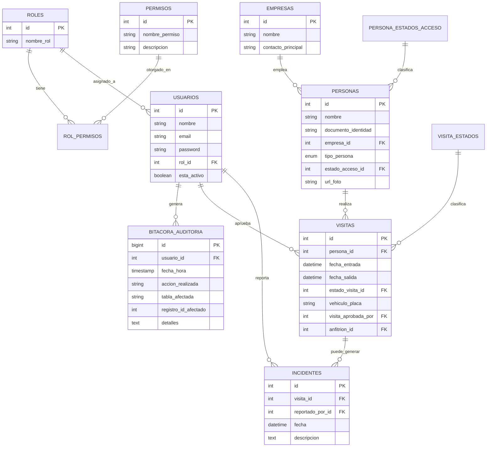

# SICA — Sistema Integrado de Control de Acceso

Proyecto académico para el Complejo Empresarial **Zona Acme**. Reemplaza el
registro manual en papel por un sistema en Java (consola) + MySQL con control
de acceso basado en roles (RBAC), auditoría inmutable y cuatro flujos de
ingreso distintos.

## 1. Descripción del proyecto

Zona Acme alberga más de 30 empresas y controlaba su acceso con libros de
registro en papel: sin trazabilidad, sin control de permisos, y con cuellos
de botella para invitados no anunciados. SICA digitaliza ese proceso:

- **RBAC real**: los permisos no están escritos en el código, viven en la
  base de datos (`roles`, `permisos`, `rol_permisos`), así que se pueden
  reconfigurar sin recompilar la aplicación.
- **Auditoría inmutable**: toda acción crítica (logins, CRUD de entidades,
  cambios de estado, incidentes, check-in/check-out) se registra en
  `bitacora_auditoria` desde la capa de servicio.
- **Cuatro flujos de ingreso** que reflejan la realidad de una portería:
  invitado pre-registrado, invitado no anunciado (aprobación en tiempo real),
  trabajador con carnet olvidado, y regularización automática de salidas
  olvidadas.

## 2. Modelo de la base de datos



Scripts en `db/schema.sql` (estructura) y `db/data.sql` (datos semilla:
roles, permisos, asignaciones RBAC, usuarios de ejemplo, estados, empresas).

## 3. Decisiones de diseño

### Arquitectura general (MVC + capas)

```
controller/  -> Controladores de consola (capa Controller)
view/        -> Entrada/salida de consola (parte de View)
service/     -> Lógica de negocio (Model, en el sentido de "dominio")
repository/  -> Acceso a datos (interfaces = puertos, impl/ = adaptadores JDBC)
model/       -> Entidades del dominio
factory/     -> Creación centralizada de repositorios
decorator/   -> Auditoría transversal
observer/    -> Notificaciones en tiempo real
exception/   -> Excepciones de negocio propias
```

### Principios SOLID aplicados

| Principio | Dónde y por qué |
|---|---|
| **SRP** | Cada clase tiene una única razón de cambio: `ConexionBD` solo gestiona la conexión, `AutorizacionService` solo valida permisos, `AuditoriaRepositoryJDBC` solo escribe/lee la bitácora. |
| **OCP** | El patrón Strategy (`FlujoAcceso`) permite agregar un quinto escenario de ingreso sin modificar `AccesoService` ni las estrategias existentes. |
| **LSP** | `AccesoServiceAuditoriaDecorator` implementa `AccesoServiceI` y puede sustituir a `AccesoService` en cualquier parte del código sin romper nada. |
| **ISP** | Los repositorios son interfaces pequeñas y específicas (`UsuarioRepository`, `PersonaRepository`, etc.) en vez de un único `Repository` genérico con decenas de métodos. |
| **DIP** | Los servicios dependen de las interfaces de `repository/`, nunca de las clases `*JDBC` directamente; `RepositoryFactory` es el único punto que conoce las implementaciones concretas. |

### Patrones de diseño (5, cumpliendo el mínimo de la rúbrica)

1. **Singleton** — `ConexionBD`: una sola conexión JDBC gestionada centralmente.
2. **Factory Method** — `RepositoryFactory`: centraliza la creación de repositorios; si se cambia la tecnología de persistencia, solo se toca esta clase.
3. **Strategy** — `FlujoAcceso` (`FlujoInvitadoPreregistrado`, `FlujoInvitadoNoAnunciado`, `FlujoCarnetOlvidado`): cada escenario de ingreso es una estrategia intercambiable seleccionada por `AccesoService`.
4. **Observer** — `GestorNotificaciones` + `ObservadorNotificacion` + `FuncionarioConsolaObserver`: al crear una visita pendiente, se notifica en tiempo real a los observadores suscritos (simulando la notificación al Funcionario de Empresa).
5. **Decorator** — `AccesoServiceAuditoriaDecorator`: envuelve `AccesoService` para alimentar `bitacora_auditoria` después de cada operación exitosa, sin mezclar esa responsabilidad con las reglas de negocio.

### Lambdas y Stream API

Concentrados sobre todo en `ReporteService` (conteos con `groupingBy` +
`counting`, filtrado de personas dentro del complejo con `filter`/`map`/
`distinct`/`sorted`) y en `GestorNotificaciones` (`forEach` con lambda para
notificar observadores), en vez de bucles `for` tradicionales.

## 4. Interfaz gráfica (JavaFX)

Además de la versión de consola (`App.java`, se conserva como referencia),
el proyecto incluye un **dashboard visual en JavaFX** (`ui/MainApp.java`) con
tema verde suave + blanco:

- **Login** — tarjeta blanca centrada, con validación y mensaje de error en línea.
- **Dashboard** — barra superior con la sesión activa y una grilla de
  tarjetas tipo panel de mando; cada tarjeta solo aparece si el rol del
  usuario tiene el permiso RBAC correspondiente (las mismas reglas de negocio
  de siempre, solo que ahora también deciden qué botones se dibujan).
- **Notificaciones en tiempo real** — al crearse una visita pendiente de
  aprobación, aparece un toast verde flotante (mismo patrón Observer que en
  consola, con un observador distinto: `NotificacionToast`).
- Todos los formularios (registrar ingreso, aprobar visitas, crear
  usuarios, reportes, bitácora, etc.) están en `ui/dialogs/`, reutilizando
  exactamente los mismos servicios de la capa `service/` — la lógica de
  negocio, el RBAC y los 5 patrones de diseño no cambiaron, solo la capa de
  presentación.

## 5. Instalación y ejecución

### Requisitos
- JDK 17+
- Maven 3.8+
- MySQL 8+ corriendo localmente

### Pasos

```bash
# 1. Crear la base de datos y cargar los datos semilla
mysql -u root -p < db/schema.sql
mysql -u root -p < db/data.sql

# 2. Configurar credenciales de conexión (si son distintas a root/root)
#    editar: src/main/java/com/acme/sica/config/ConexionBD.java

# 3a. Ejecutar la versión GRÁFICA (JavaFX) — recomendada
mvn clean javafx:run

# 3b. O compilar el jar ejecutable con todo incluido
mvn clean package
java -jar target/sica-jar-with-dependencies.jar

# 3c. Si prefieres la versión de consola original:
#     cambia temporalmente el mainClass en pom.xml a com.acme.sica.App
#     y ejecuta "mvn clean package && java -jar target/sica-jar-with-dependencies.jar"
```

## 6. Guía de uso — credenciales de ejemplo por rol

Todas las contraseñas de ejemplo son: **`Acme#2026`**

| Rol | Email | Qué puede hacer |
|---|---|---|
| Superusuario | `admin@acme.com` | Todo el sistema, incluida gestión de usuarios y empresas |
| Supervisor de Seguridad | `supervisor@acme.com` | Operación completa de accesos, incidentes y auditoría |
| Guarda de Seguridad | `guarda@acme.com` | Registrar ingresos/salidas, crear personas, reportar incidentes |
| Funcionario de Empresa | `funcionario@acme.com` | Aprobar/rechazar visitas pendientes, registrar invitados propios |

### Flujo de prueba sugerido

1. Inicia sesión como **Guarda** → registra el ingreso del documento
   `1122334455` (invitado de ejemplo, sin visita pre-aprobada) → el sistema
   lo deja "Pendiente de Aprobación" y notifica por consola.
2. Inicia sesión como **Funcionario** → opción "Gestionar aprobaciones" →
   aprueba la visita.
3. Vuelve a iniciar sesión como **Guarda** → revisa el reporte "Personas
   dentro del complejo" (opción 10) para confirmar el check-in.
4. Explora la opción 13 (bitácora de auditoría) para ver cómo cada acción
   anterior quedó registrada automáticamente.
# Proyecto-SICA---Zona-Acme

