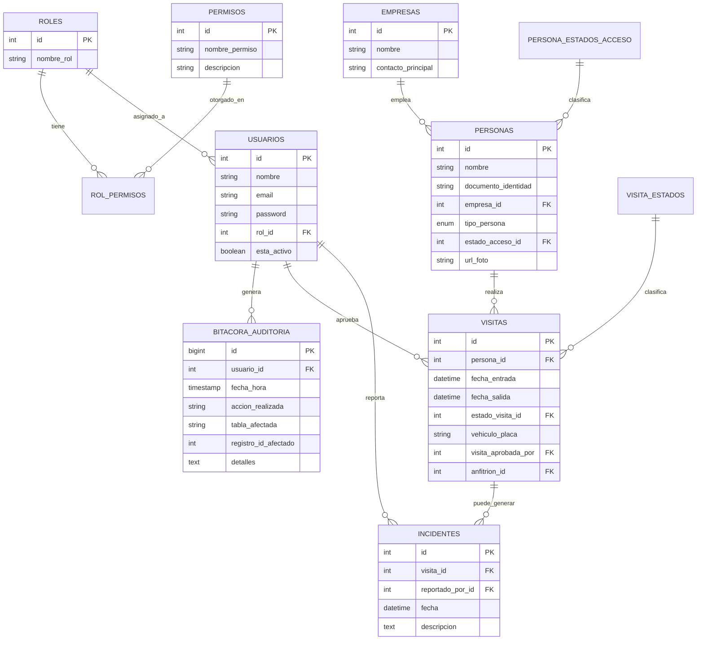

# SICA — Sistema Integrado de Control de Acceso


Proyecto académico para el Complejo Empresarial **Zona Acme**. Reemplaza el
registro manual en papel por un sistema en Java + MySQL con control
de acceso basado en roles (RBAC), auditoría inmutable y cuatro flujos de
ingreso distintos. Incluye dos interfaces: una gráfica en **JavaFX**
(dashboard verde/blanco) y una de **consola**, ambas sobre la misma capa de
negocio.

## 1. Descripción del proyecto

Zona Acme alberga más de 30 empresas y controlaba su acceso con libros de
registro en papel: sin trazabilidad, sin control de permisos, y con cuellos
de botella para invitados no anunciados. SICA digitaliza ese proceso:

- **RBAC real**: los permisos no están escritos en el código, viven en la
  base de datos (`roles`, `permisos`, `rol_permisos`), así que se pueden
  reconfigurar sin recompilar la aplicación.
- **Auditoría inmutable**: toda acción crítica (logins, CRUD de entidades,
  cambios de estado, incidentes, check-in/check-out) se registra en
  `bitacora_auditoria` desde la capa de servicio.
- **Cuatro flujos de ingreso** que reflejan la realidad de una portería:
  invitado pre-registrado, invitado no anunciado (aprobación en tiempo real),
  trabajador con carnet olvidado, y regularización automática de salidas
  olvidadas.

## 2. Modelo de la base de datos



Scripts en `db/schema.sql` (estructura) y `db/data.sql` (datos semilla:
roles, permisos, asignaciones RBAC, usuarios de ejemplo, estados, empresas).

## 3. Decisiones de diseño

### Arquitectura general (MVC + capas)

```
controller/  -> Controladores de consola (capa Controller)
view/        -> Entrada/salida de consola (parte de View)
service/     -> Lógica de negocio (Model, en el sentido de "dominio")
repository/  -> Acceso a datos (interfaces = puertos, impl/ = adaptadores JDBC)
model/       -> Entidades del dominio
factory/     -> Creación centralizada de repositorios
decorator/   -> Auditoría transversal
observer/    -> Notificaciones en tiempo real
exception/   -> Excepciones de negocio propias
ui/          -> Interfaz gráfica JavaFX (login, dashboard, diálogos)
```

### Estructura de carpetas

```
ProyectoSICA/
├── db/
│   ├── schema.sql              # Creación de las 11 tablas
│   └── data.sql                # Roles, permisos, usuarios y datos de ejemplo
├── docker-compose.yml          # MySQL 8 listo para desarrollo local
├── pom.xml
├── README.md
└── src/main/
    ├── java/com/acme/sica/
    │   ├── App.java             # Entrada de la versión consola
    │   ├── config/               # Conexión BD (Singleton) + hash de passwords
    │   ├── model/                 # Entidades: Usuario, Persona, Visita, etc.
    │   ├── exception/             # Excepciones de negocio propias
    │   ├── repository/            # Interfaces (puertos)
    │   │   └── impl/               # Implementaciones JDBC (adaptadores)
    │   ├── factory/               # RepositoryFactory (Factory Method)
    │   ├── observer/              # Notificaciones en tiempo real (Observer)
    │   ├── decorator/             # Auditoría automática (Decorator)
    │   ├── service/               # Reglas de negocio y RBAC
    │   │   └── flujos/             # Los 4 escenarios de ingreso (Strategy)
    │   ├── controller/            # Controladores de consola
    │   ├── view/                  # Entrada/salida de consola
    │   └── ui/                    # Interfaz gráfica JavaFX
    │       ├── MainApp.java        # Punto de entrada gráfico
    │       ├── Launcher.java       # Lanzador (evita error de módulos JavaFX)
    │       └── dialogs/            # Un diálogo por cada operación
    └── resources/css/theme.css   # Tema visual verde suave + blanco
```

### Principios SOLID aplicados

| Principio | Dónde y por qué |
|---|---|
| **SRP** | Cada clase tiene una única razón de cambio: `ConexionBD` solo gestiona la conexión, `AutorizacionService` solo valida permisos, `AuditoriaRepositoryJDBC` solo escribe/lee la bitácora. |
| **OCP** | El patrón Strategy (`FlujoAcceso`) permite agregar un quinto escenario de ingreso sin modificar `AccesoService` ni las estrategias existentes. |
| **LSP** | `AccesoServiceAuditoriaDecorator` implementa `AccesoServiceI` y puede sustituir a `AccesoService` en cualquier parte del código sin romper nada. |
| **ISP** | Los repositorios son interfaces pequeñas y específicas (`UsuarioRepository`, `PersonaRepository`, etc.) en vez de un único `Repository` genérico con decenas de métodos. |
| **DIP** | Los servicios dependen de las interfaces de `repository/`, nunca de las clases `*JDBC` directamente; `RepositoryFactory` es el único punto que conoce las implementaciones concretas. |

### Patrones de diseño (5, cumpliendo el mínimo de la rúbrica)

1. **Singleton** — `ConexionBD`: una sola conexión JDBC gestionada centralmente.
2. **Factory Method** — `RepositoryFactory`: centraliza la creación de repositorios; si se cambia la tecnología de persistencia, solo se toca esta clase.
3. **Strategy** — `FlujoAcceso` (`FlujoInvitadoPreregistrado`, `FlujoInvitadoNoAnunciado`, `FlujoCarnetOlvidado`): cada escenario de ingreso es una estrategia intercambiable seleccionada por `AccesoService`.
4. **Observer** — `GestorNotificaciones` + `ObservadorNotificacion` + `FuncionarioConsolaObserver`: al crear una visita pendiente, se notifica en tiempo real a los observadores suscritos (simulando la notificación al Funcionario de Empresa).
5. **Decorator** — `AccesoServiceAuditoriaDecorator`: envuelve `AccesoService` para alimentar `bitacora_auditoria` después de cada operación exitosa, sin mezclar esa responsabilidad con las reglas de negocio.

### Lambdas y Stream API

Concentrados sobre todo en `ReporteService` (conteos con `groupingBy` +
`counting`, filtrado de personas dentro del complejo con `filter`/`map`/
`distinct`/`sorted`) y en `GestorNotificaciones` (`forEach` con lambda para
notificar observadores), en vez de bucles `for` tradicionales.

## 4. Interfaz gráfica (JavaFX)

Además de la versión de consola (`App.java`, se conserva como referencia),
el proyecto incluye un **dashboard visual en JavaFX** (`ui/MainApp.java`) con
tema verde suave + blanco:

- **Login** — tarjeta blanca centrada, con validación y mensaje de error en línea.
- **Dashboard** — barra superior con la sesión activa y una grilla de
  tarjetas tipo panel de mando; cada tarjeta solo aparece si el rol del
  usuario tiene el permiso RBAC correspondiente (las mismas reglas de negocio
  de siempre, solo que ahora también deciden qué botones se dibujan).
- **Notificaciones en tiempo real** — al crearse una visita pendiente de
  aprobación, aparece un toast verde flotante (mismo patrón Observer que en
  consola, con un observador distinto: `NotificacionToast`).
- Todos los formularios (registrar ingreso, aprobar visitas, crear
  usuarios, reportes, bitácora, etc.) están en `ui/dialogs/`, reutilizando
  exactamente los mismos servicios de la capa `service/` — la lógica de
  negocio, el RBAC y los 5 patrones de diseño no cambiaron, solo la capa de
  presentación.

## 5. Base de datos con Docker

El proyecto incluye `docker-compose.yml` con MySQL 8 ya configurado para
coincidir con las credenciales por defecto de `ConexionBD.java`
(`root`/`root`, puerto `3306`, base `sica_db`), y con `schema.sql` +
`data.sql` montados para cargarse automáticamente la primera vez.

```bash
# Levantar el contenedor (crea la BD, tablas y datos semilla automáticamente)
docker compose up -d

# Verificar que quedó arriba y saludable
docker compose ps

# Ver logs si algo falla
docker compose logs -f sica_mysql
```

Con eso, `ConexionBD.java` ya apunta al lugar correcto sin tocar nada más.

## 6. Instalación y ejecución

### Requisitos
- JDK 17+
- Maven 3.8+
- MySQL 8+ corriendo localmente

### Pasos

```bash
# 1. Crear la base de datos y cargar los datos semilla
mysql -u root -p < db/schema.sql
mysql -u root -p < db/data.sql

# 2. Configurar credenciales de conexión (si tu MySQL local no es root/root)
#    definí las variables de entorno DB_URL / DB_USER / DB_PASSWORD antes de
#    ejecutar, por ejemplo (Windows PowerShell):
#      $env:DB_PASSWORD = "tu_password_local"
#    o en Linux/Mac:
#      export DB_PASSWORD=tu_password_local
#    Si no se definen, se usan los valores por defecto (root/root, sica_db).

# 3a. Ejecutar la versión GRÁFICA (JavaFX) — recomendada, más confiable
mvn clean javafx:run

# 3b. O compilar el jar ejecutable con todo incluido
mvn clean package
java -jar target/sica-jar-with-dependencies.jar

# 3c. Si ejecutas desde el botón "Run" de un IDE (VS Code, IntelliJ, etc.)
#     NO selecciones MainApp.java como clase a ejecutar — selecciona
#     Launcher.java (com.acme.sica.ui.Launcher). Es un lanzador que evita el
#     error "JavaFX runtime components are missing" al ejecutar directamente
#     una clase que extiende Application.

# 3d. Si prefieres la versión de consola original:
#     ejecuta la clase com.acme.sica.App (no requiere JavaFX)
```

## 7. Guía de uso — credenciales de ejemplo por rol

Todas las contraseñas de ejemplo son: **`Acme#2026`**

| Rol | Email | Qué puede hacer |
|---|---|---|
| Superusuario | `admin@acme.com` | Todo el sistema, incluida gestión de usuarios y empresas |
| Supervisor de Seguridad | `supervisor@acme.com` | Operación completa de accesos, incidentes y auditoría |
| Guarda de Seguridad | `guarda@acme.com` | Registrar ingresos/salidas, crear personas, reportar incidentes |
| Funcionario de Empresa | `funcionario@acme.com` | Aprobar/rechazar visitas pendientes, registrar invitados propios |

### Flujo de prueba sugerido

1. Inicia sesión como **Guarda** (`guarda@acme.com`) → "Registrar ingreso" con
   el documento `1122334455` (invitado de ejemplo, sin visita pre-aprobada) →
   el sistema lo deja "Pendiente de Aprobación" y notifica en tiempo real
   (toast verde en la versión gráfica, mensaje en la versión de consola).
2. Inicia sesión como **Funcionario** (`funcionario@acme.com`) → "Aprobaciones
   pendientes" → aprueba la visita.
3. Vuelve a iniciar sesión como **Guarda** → revisa "Personas dentro del
   complejo" para confirmar el check-in.
4. Revisa "Bitácora de auditoría" (rol Superusuario o Supervisor) para ver
   cómo cada acción anterior quedó registrada automáticamente.

## 8. Solución de problemas comunes

| Síntoma | Causa habitual | Solución |
|---|---|---|
| `Credenciales inválidas o usuario inactivo` con las credenciales de ejemplo | El `data.sql` cargado tiene un hash de contraseña desactualizado | Ejecuta el `UPDATE usuarios SET password = ...` con el hash correcto (ver `db/data.sql`), o vuelve a cargar `data.sql` completo |
| `Error: JavaFX runtime components are missing` | Se ejecutó `MainApp` directamente en vez de `Launcher` | Ejecuta `com.acme.sica.ui.Launcher`, o usa `mvn clean javafx:run` |
| `Access denied for user` al conectar a MySQL | Las credenciales por defecto (`root`/`root`) no coinciden con tu MySQL | Definí las variables de entorno `DB_USER`/`DB_PASSWORD` con tus credenciales reales antes de ejecutar (ver sección 6, paso 2) |
| `Communications link failure` / `Connection refused` | MySQL no está corriendo, o el puerto no es el 3306 | Verifica con `docker compose ps` (si usas Docker) o que el servicio MySQL local esté activo |
| `Unknown database 'sica_db'` | El esquema tiene otro nombre en tu MySQL | Definí la variable de entorno `DB_URL` apuntando al nombre correcto, o creá el esquema como `sica_db` |